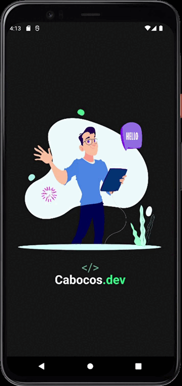

<h1 align="center">
   Hello Animation<br>
</h1>

<br>

<h1 align="center">
  
</h1>


## 💻 Projeto

Aplicação construída para exemplificar a ultilização de animações do Adobe After Effects exportadas como JSON, fazendo uso da biblioteca **[Lottie React Native](https://github.com/lottie-react-native/lottie-react-native)**.
<br>

## 🎲 Executar aplicação

```bash
# Clone este repositório
$ git clone https://github.com/WillianMedeiros14/HelloAnimations.git

# Entre na pasta do projeto.
$ cd HelloAnimations

# Instale as dependências
$ yarn install

# Em uma aba do terminal execute
$ yarn start

# Em outra aba do terminal execute
$ yarn android
ou
$ yarn ios
```

## 🚀 Tecnologias e recursos ultilizados;

- **[React Native](https://reactnative.dev/)**.
- **[Lottie React Native](https://github.com/lottie-react-native/lottie-react-native)**.
- **[Link da animação](https://lottiefiles.com/51971-hello)**.


<br><br><br>
Feito com carinho por Willian Medeiros.